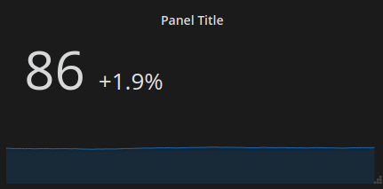

# Trendstat Panel 

A trend stat panel for [Grafana](http://grafana.org/).




## Overview

This panel is very similar to the Single Stat Panel, but it shows the percentage change between the first and last values of a series. This is useful to monitor a value as it changes over time.

## Development 

Install the dependencies 

```bash 
npm install -g grunt
npm install
```

Build `dist`
```bash
grunt
```


Restart grafana server

```bash
sudo service grafana-server restart
```